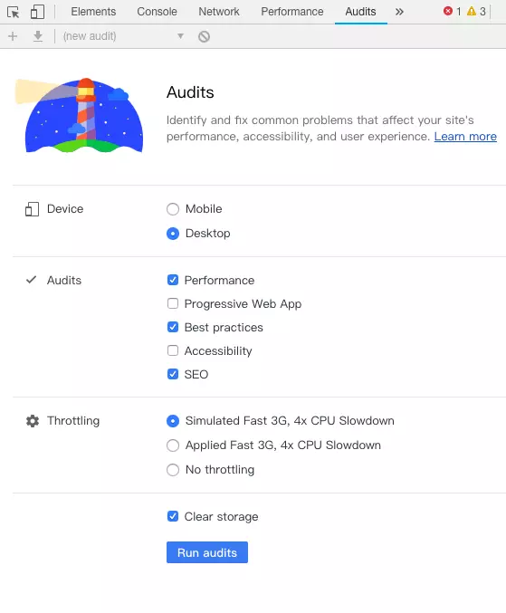
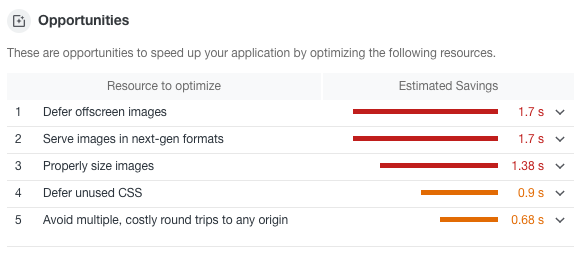
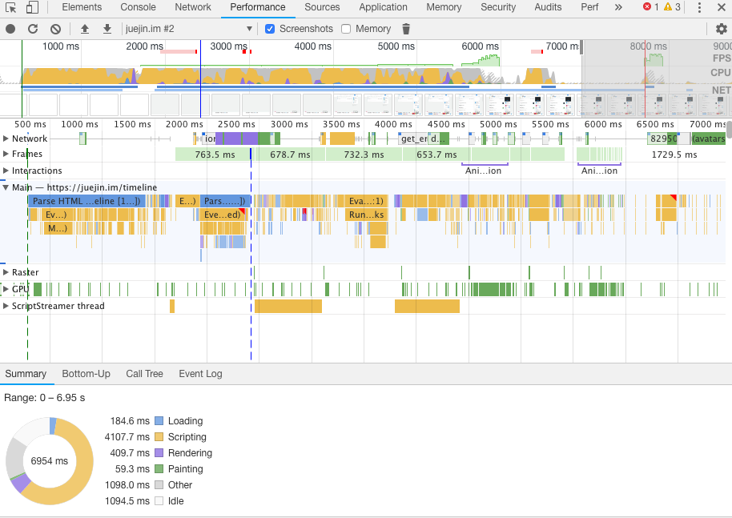

# 性能测试

## 测试性能工具

###  Audits

选择想测试的功能然后点击 Run audits ，工具就会自动运行帮助我们测试问题并且给出一个完整的报告。

可以看到报告中分别为**性能、体验、SEO** 都给出了打分，并且每一个指标都有详细的评估。

评估结束后，工具还提供了一些建议便于我们提高这个指标的分数。

 ### Performance 工具

在这张图中，我们可以详细的看到每个时间段中浏览器在处理什么事情，哪个过程最消耗时间，便于我们更加详细的了解性能瓶颈。