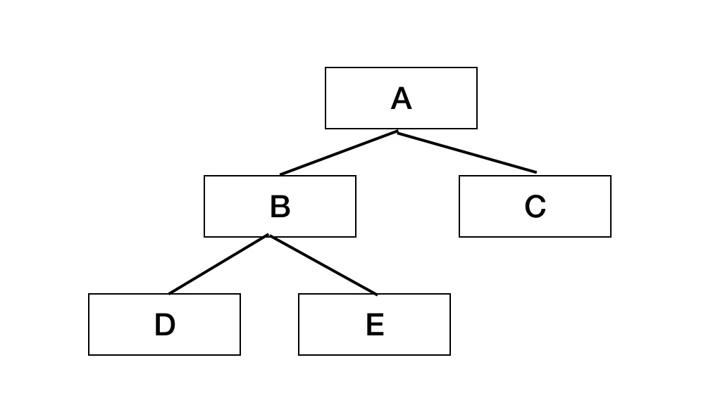

### Fiber 

- what is Fiber？

  - 16引入调和引擎

  - 关键特性：时间分片和暂停

- Fiber 是一种数据结构，一个Fiber是一个任务分片

  - 暂停当前工作任务，稍后返回继续
  - 分配不同优先级给不同任务
  - 复用任务
  - 丢弃/终止任务

  

  如图组件关系，只是父指向子,`React16`之前的调度器称为栈调度。

  > `jsx`最后被`babel`编译为：`React.createElement(type, {props}, children)`, 而`jsx`又是嵌套的，势必会产生递归的代码。没办法被暂停重启，也就无法让代码断开重连。而且函数的**递归**还需要保存上下文、执行、`pop`等等。

  Fiber结构，每一个节点都有相应的child（第一个子节点）、sibling（兄弟节点）、return（父节点）指向。链表不需要保存上下文、`push`、`pop`等

  > 通过这三个属性就能够将一颗树转换为链表了

  由此便不需要再进行递归，而是改为循环

### React Fiber 工作流程

两个树，有新旧之分

- current tree：反应当前屏幕上的UI。HostRoot.current
- workInProgress tree：反映将要变化的UI。current.alternate。
- 两棵树上对应的Fiber Node通过alternate属性相互引用。

### React 组件更新细节

#### 确定更新数量

`React16`之前都是从`root`或者`setState`的组件开始更新整个树，开发者能做的，只有在`shouldComponentUpdate`进行一些优化，避免一些无用的比较。

而`React16`将虚拟`DOM`转换为`fiber`，`fiber`再转换为`DOM`。

#### schedule

setState->enqueueUpdate->scheduleWork->requestWork

#### render

### 并行渲染