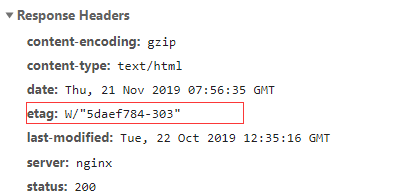
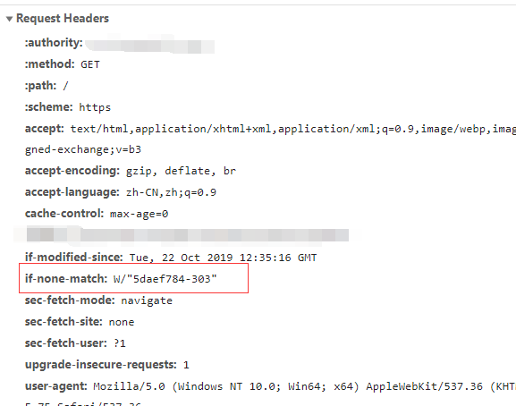
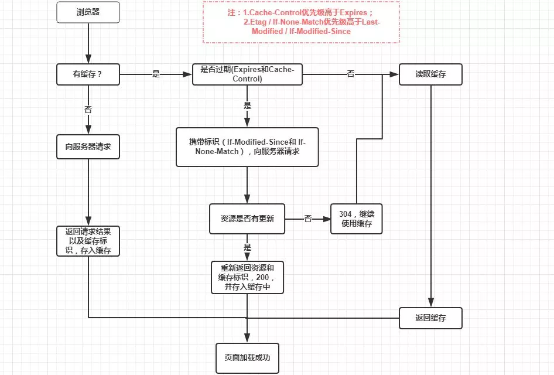

[TOC]


### 缓存

 - 浏览器每次发起请求，都会先在浏览器缓存中查找该请求的结果以及缓存标识
 - 浏览器每次拿到返回的请求结果都会将该结果和缓存标识存入浏览器缓存中

### 为什么要缓存？

减少HTTP请求

### 强缓存

强制缓存就是向浏览器缓存查找该请求结果，并根据该结果的缓存规则来决定是否使用该缓存结果的过程，

#### 强缓存缓存规则

当浏览器向服务器发起请求时，服务器会将缓存规则放入HTTP响应报文的HTTP头中和请求结果一起返回给浏览器，控制强制缓存的字段分别是Expires和Cache-Control，其中Cache-Control优先级比Expires高。

Chrome浏览器状态码表现为:

> 200 (from disk cache)或是200 OK (from memory cache)

缓存是从磁盘中获取还是从内存中获取?

> Chrome会根据本地内存的使用率来决定缓存存放在哪。

#### Expires

Expires是HTTP/1.0控制网页缓存的字段，其值为**服务器返回该请求结果缓存的到期时间**，即再次发起该请求时，如果客户端的时间小于Expires的值时，直接使用缓存结果。

> Expires是HTTP/1.0的字段，但是现在浏览器默认使用的是HTTP/1.1，那么在HTTP/1.1中网页缓存还是否由Expires控制？

到了HTTP/1.1，**Expire已经被Cache-Control替代**，原因在于Expires控制缓存的原理是使用客户端的时间与服务端返回的时间做对比，那么如果客户端与服务端的时间因为某些原因（例如时区不同；客户端和服务端有一方的时间不准确）发生误差，那么强制缓存则会直接失效，这样的话强制缓存的存在则毫无意义。

#### Cache-Control

在HTTP/1.1中，Cache-Control是最重要的规则，主要用于控制网页缓存，主要取值为：

- private（默认）：所有内容只有客户端可以缓存

 - public： 表示该响应可以被任何中间人缓存。如中间代理

 - no-cache：跳过强缓存，使用**协商缓存来验证**决定

 - no-store：所有内容都不会被缓存

 - max-age=xxx (xxx is numeric)：缓存内容将在xxx秒后失效

状态码为灰色的请求则代表使用了强制缓存，请求对应的Size值则代表该缓存存放的位置，分别为from memory cache 和 from disk cache。浏览器读取顺序memory=>cache。

#### memory cache 和disk cache区别

 - 内存缓存(from memory cache)：内存缓存具有两个特点，分别是快速读取和时效性：

   - 快速读取：内存缓存会将编译解析后的文件，直接存入该进程的内存中，占据该进程一定的内存资源，以方便下次运行使用时的快速读取。

   - 时效性：一旦该进程关闭，则该进程的内存则会清空。
 - 硬盘缓存(from disk cache)：硬盘缓存则是直接将缓存写入硬盘文件中，读取缓存需要对该缓存存放的硬盘文件进行I/O操作，然后重新解析该缓存内容，读取复杂，速度比内存缓存慢。


### 协商缓存

协商缓存就是强制缓存失效后，浏览器携带缓存标识向服务器发起请求，由服务器根据缓存标识决定是否使用缓存的过程。

- 协商缓存生效，返回304
- 协商缓存失效，返回200和请求结果结果

协商缓存的标识也是在响应报文的HTTP头中和请求结果一起返回给浏览器的，控制协商缓存的字段分别有：Last-Modified / If-Modified-Since和Etag / If-None-Match，其中Etag / If-None-Match的优先级比Last-Modified / If-Modified-Since高。

#### Etag （响应）/ If-None-Match（请求）

Etag是服务器响应请求时，返回当前资源文件的一个唯一标识(由服务器生成)。优点是，当做一些



If-None-Match是客户端再次发起该请求时，携带上次请求返回的唯一标识Etag值，通过此字段值告诉服务器该资源上次请求返回的唯一标识值。服务器收到该请求后，发现该请求头中含有If-None-Match，则会根据If-None-Match的字段值与该资源在服务器的Etag值做对比，一致则返回304，代表资源无更新，继续使用缓存文件；不一致则重新返回资源文件，状态码为200



#### Last-Modified（响应头） / If-Modified-Since（请求）

Last-Modified是服务器响应请求时，返回该资源文件在服务器最后被修改的时间

If-Modified-Since则是客户端再次发起该请求时，携带上次请求返回的Last-Modified值，通过此字段值告诉服务器该资源上次请求返回的最后被修改时间。服务器收到该请求，发现请求头含有If-Modified-Since字段，则会根据If-Modified-Since的字段值与该资源在服务器的最后被修改时间做对比，若服务器的资源最后被修改时间大于If-Modified-Since的字段值，则重新返回资源，状态码为200；否则则返回304，代表资源无更新，可继续使用缓存文件。

### 有Last-Modified为什么还要有Etag

如果资源发生变化，Etag就会发生变化，就会把最新的资源给客户端返回去，而lastModified不识别s（秒）单位里的修改，所以如果资源在s（秒）单位里发生了修改，那lastModified也不会发生改变。

### 启发式缓存

```js
accept-ranges: bytes
content-length: 151771
content-type: application/javascript
date: Tue, 26 Nov 2019 05:48:14 GMT
etag: "5daef784-250db"
last-modified: Tue, 22 Oct 2019 12:35:16 GMT
server: nginx
status: 200
```

**Date 和 Last-Modified 之间的时间差值，取其值的10%作为缓存时间周期。** 在缓存周期内，再次刷新时，命中强缓存，从缓存中换取。 

### 不同刷新的请求执行过程

##### 浏览器地址栏中写入URL，回车

- 浏览器发现缓存中有这个文件了，不用继续请求了，直接去缓存拿。（最快）

##### F5

- F5就是告诉浏览器，别偷懒，好歹去服务器看看这个文件是否有过期了。于是浏览器就战战兢兢的发送一个请求带上If-Modify-since。

##### Ctrl+F5

- 告诉浏览器，你先把你缓存中的这个文件给我删了，然后再去服务器请求个完整的资源文件下来。于是客户端就完成了强行更新的操作.

### 总结

强制缓存优先于协商缓存进行，若强制缓存(Expires和Cache-Control)生效则直接使用缓存，若不生效则进行协商缓存(Last-Modified / If-Modified-Since和Etag / If-None-Match)，协商缓存由服务器决定是否使用缓存，若协商缓存失效，那么代表该请求的缓存失效，重新获取请求结果，再存入浏览器缓存中；生效则返回304，继续使用缓存，主要过程如下：


